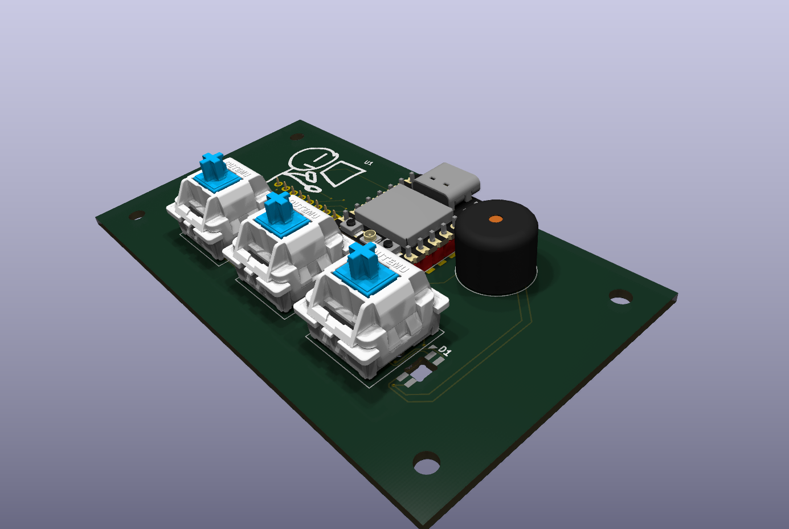
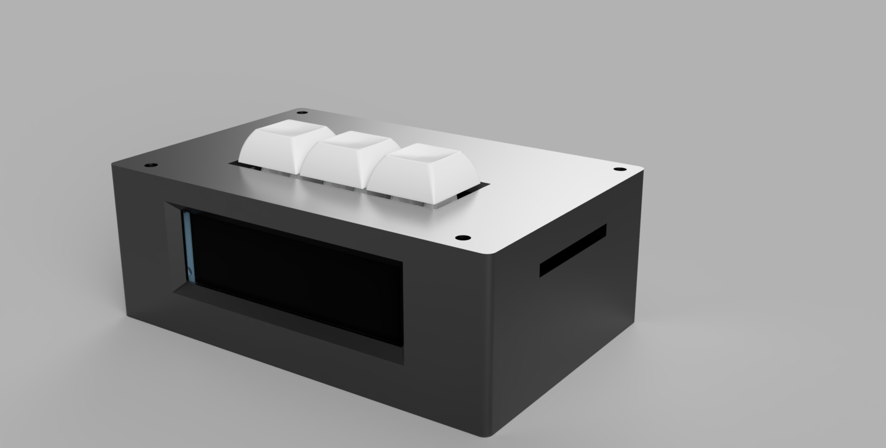
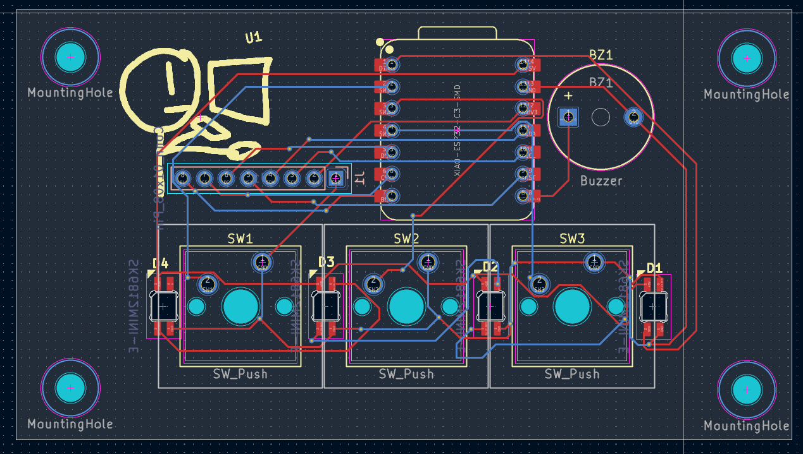

# Hop Off Bro
An alarm clock built for standing desk workers, telling you to switch from sitting to standing or to just hop off!

## Features:
 - 3 Cherry MX switches for input
 - 2.25 in TFT screen
 - LEDs because who doesnt want RGB!
 - Firmware made using PlatformIO for modularity

## Gallery:

## BOM:
- 1x Seeed XIAO ESP32C3
- 3x MX-Style Keyboard switches
- 3x White DSA keycaps
- 4x SK6812 LEDs
- 2.54 mm 8 male pin header
- 8x 20cm Female-Female Jumper wires
- 8x M3x5x4 Heatset Inserts
- 4x M3x8mm Screws
- 4x M3x16mm Screws
- 1x 3.3V Piezo Buzzer